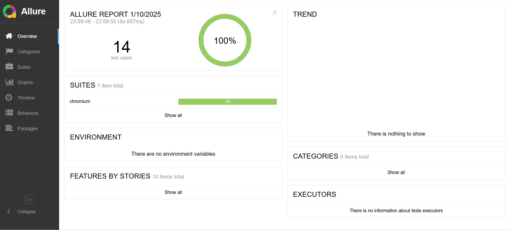

# Playwright typescript framework
This repo primarily focuses on playwright typescript UI automation for [Sauce demo](https://www.saucedemo.com/) application, and also test basic API CRUD operation. Used github action for CI/CD integration.
Below have mentioned the prerequisites and installation steps

## Pre-requisites
- node
- Typescript
- Java(ensure its added in Environmental variable)
- Any IDE (preferably VS Code)

## Installation
- Clone this repository
- Open the repository in IDE
- Open IDE terminal and run `npm install`(for installing dependencies) and `npx playwright install`(for installing playwright browsers)

## To run test and view report
- Run the command `npm run test`
- This command will run all the test against 3 browsers(chromium,webkit,firefox)
- Run the command `npm run test.chromium`
- This command will run all the test against chromium browser
- Once the execution completes, the report will be automatically opening in the default browser as below

## Project folder structure

### .github\workflows
- playwrught.yml -> Has the configuration for intergrating and executing test as part of github action, and the execution report is stored under each job as a zip file, under Artifacts section [here](https://github.com/sriramgithubrepo/playwright-Typescript-UI/actions/runs/12724860455)

### allure-report
- index.html -> Allure HTML report, which automatically opens in the default browser post test completion

### allure-results
-  Contains JSON report for each test execution

### fixures
-  pomFixtures.ts -> Customised Fixture file to override playwright default fixture

### node_modules
- Contains the installed dependencies source files

### playwright-report
- Contains the default playwright reports such has html report

### test-results
- Contains the test execution results such as traces,screenshot,video

### tests
- helper/utils.ts -> Contains the reuseable functions

- pages -> Contains the page object files for all the pages in Sauce demo website

- testData/constants.json -> Holds the constant data such static text

- testData/sauceDemoTestData.json -> Holds the test data that are refered in tests.

- testData/booking.json -> Holds the data for create booking API

- testData/booking.json -> Holds the data for updating a booking API

- addRemoveProductTest.spec.ts -> Test that validates user can add and then remove the products.

- apiCRUD.spec.ts -> API test to validate CRUD operations such as Get booking,Create booking,Update booking(both PUT & PATCH),Delete booking scenarios for [BookingAPI](https://restful-booker.herokuapp.com/apidoc/index.html#api-Booking)

- loginTest.spec.ts -> Test that validates login with valid and invalid credentials

- placeOrderTest.spec.ts -> Test that validates the end to end functional flow of placing an order in sauce demo website

- productSortingTest.spec.ts -> Test that validates all 4 sorting functionalities(Description ascending/descending and Price ascending/descending) available in products page

### Root folder
- .env -> Holds sensitive information and URLs. Having them in .env file helps in parameterising the values from CLI and configuring environment variables in CI runners

- global-seup.ts -> Has the step for token generation for API test, which is then being shared in other API test

- package.json and package-lock.json -> Dependency management file

- playwright.config.ts -> Holds the project level configuration of playwright
